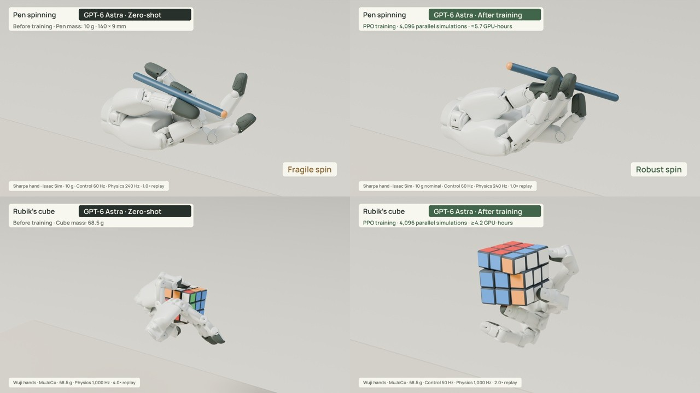

# Dexterous Astra



| Task | Robot, simulator | Zero-shot | Trained |
| --- | --- | --- | --- |
| Pen spinning | Sharpa Wave hand, Isaac Lab | sampled finger-keyframe planner | PPO policy: 3 turns and a hold |
| Rubik's cube | Wuji hands, MuJoCo | two-hand scripted controller: two moves | one-hand learned turns and rolls: solves `U F L` |

Each task has `sim/` (environment), `zero_shot/` (script), `policy/` (runs the checkpoints) and `checkpoints/`.

```bash
ISAAC_PY=... PY=... pen/run_zero_shot.sh runs/pen-zero
ISAAC_PY=... PY=... pen/run_policy.sh    runs/pen-policy
PY=... cube/run_zero_shot.sh runs/cube-zero
PY=... cube/run_policy.sh    runs/cube-policy
```

`ISAAC_PY`: Python 3.11 with Isaac Lab 2.3.2 and `rsl-rl-lib==3.0.1`. `PY`: `pen/requirements.txt` or `cube/requirements.txt`.
